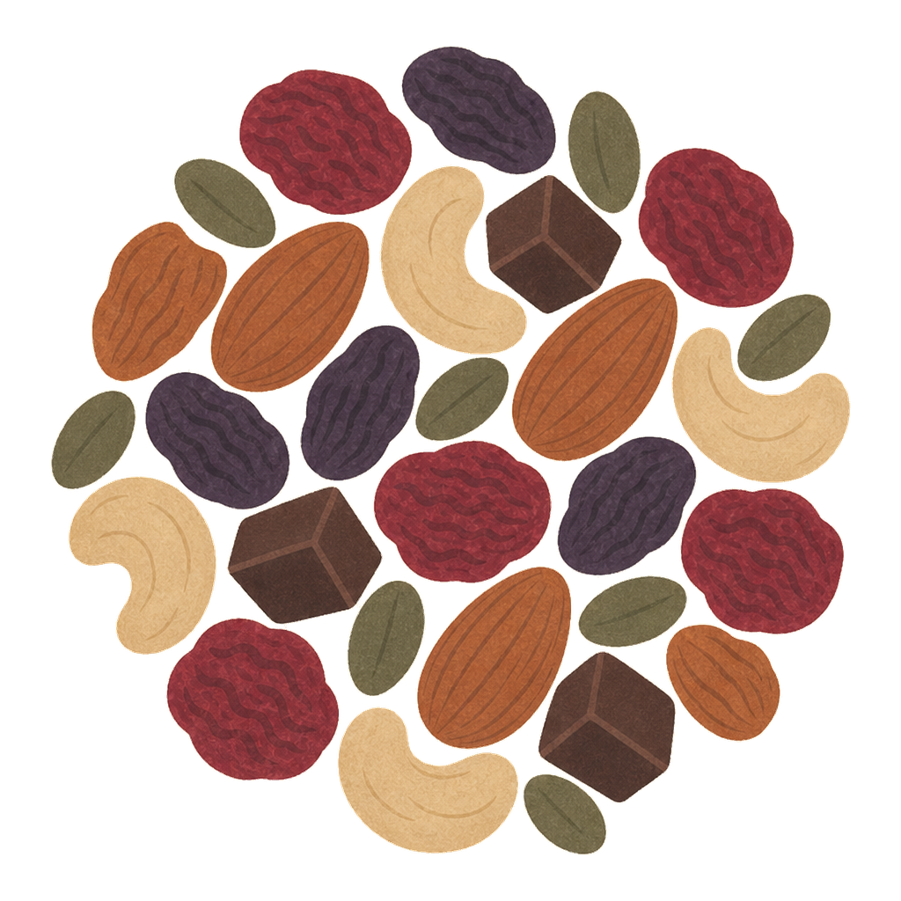

<p align="center">
  
</p>

# trail mix

[](https://github.com/djpardis/trailmix/actions/workflows/ci.yml)


**trail mix** is an offline audio-analysis toolkit written in Rust. It takes
normalized mono PCM and returns tempo, musical key, beat positions, and compact
waveform data. Analysis runs locally.

## Structure

- **beat salad** estimates global BPM, beat positions with downbeat inference,
  and local tempo segments. Uses autocorrelation with harmonic scoring and a
  gentle octave prior.
- **key lime** estimates global and local major or minor keys using dual chroma
  extraction (Goertzel + Constant-Q Transform), multiple key profiles
  (Krumhansl-Kessler, Temperley, EDMA, and learned), median aggregation, and
  confidence-gated segmentation.
- **sampler platter** generates compact min/max/RMS waveform columns.

The `trailmix` crate combines the three analyzers behind one PCM-in/results-out
API. File decoding is kept in the optional `trailmix-codecs` crate.

Supporting crates:

- `trailmix-cli`: command-line analysis of individual files.
- `trailmix-bench`: machine-readable benchmark reports (MIREX-weighted key
  score, beat F1, Serato agreement, timing).
- `trailmix-manifest`: shared corpus annotation schema.
- `trailmix-datasets`: imports GiantSteps reference annotations.
- `test-kitchen`: loopback browser UI for playback, annotation, and on-demand
  analysis.

## Quick start

**trail mix** requires Rust 1.85 or newer. To try the CLI from the repository root:

```sh
cargo run -p trailmix-cli -- path/to/audio.flac
```

The CLI supports MP3, FLAC, AIFF, WAV, AAC-in-MP4, and ALAC-in-MP4 and prints
versioned analysis results as JSON. CI tests Linux, macOS, and Windows.

## Design principles

- **Pure Rust, zero ML dependencies**: all analysis is deterministic DSP.
- **Small binary**: all three analyzers fit in under 3 MB.
- **Portable**: runs on ARM, x86, and WASM without platform-specific
  inference machinery.
- **Interpretable**: intermediate features (chroma vectors, onset envelopes,
  confidence scores) are exposed, not hidden in a black box.

## Accuracy context

**trail mix** uses heuristic DSP, not trained models. Accuracy is below ML-based
systems (CNN/transformer SOTA reaches ~73-78% key accuracy on GiantSteps). The
tradeoff is explicit: lower accuracy in exchange for zero deployment complexity,
no model downloads, and full algorithmic transparency.

See [architecture](ARCHITECTURE.md) for algorithm descriptions and design
rationale.

## License

**trail mix** is available under your choice of the [MIT License](LICENSE-MIT) or
the [Apache License, Version 2.0](LICENSE-APACHE). Codec-related
notices are recorded in [THIRD_PARTY.md](THIRD_PARTY.md).
